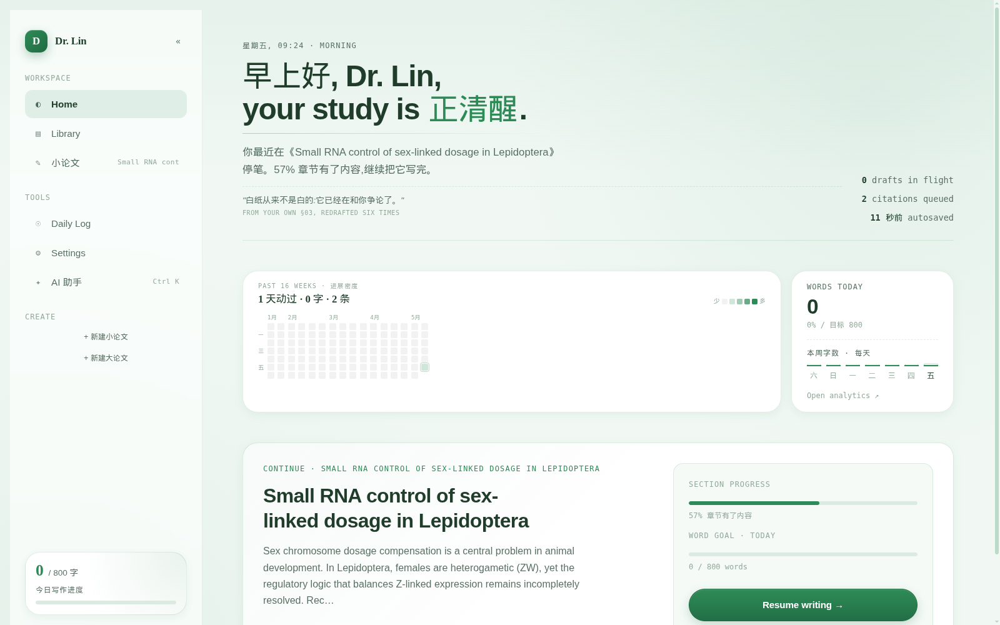
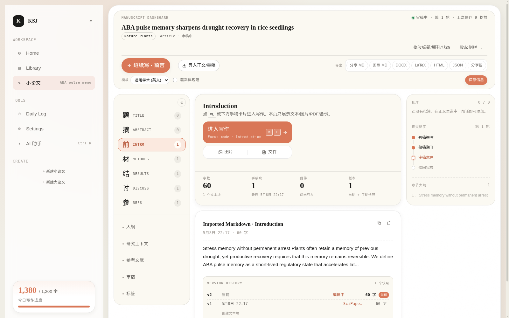
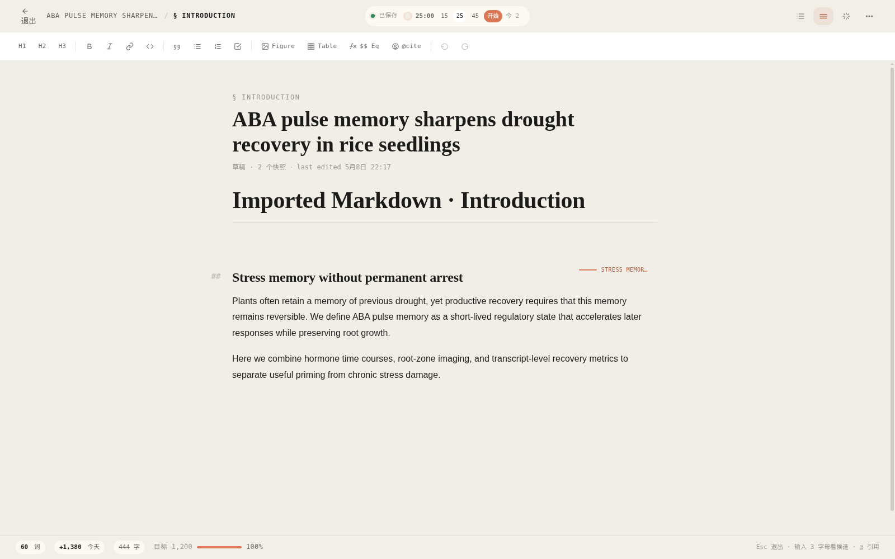
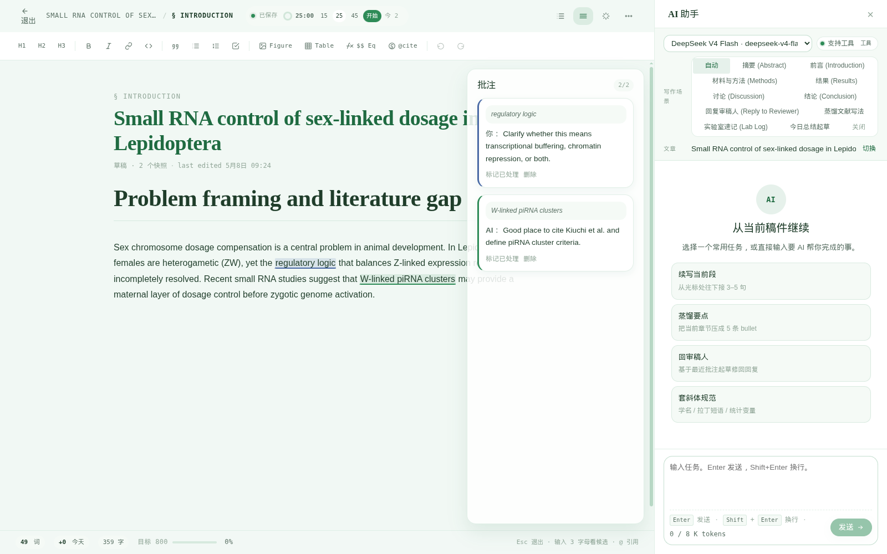
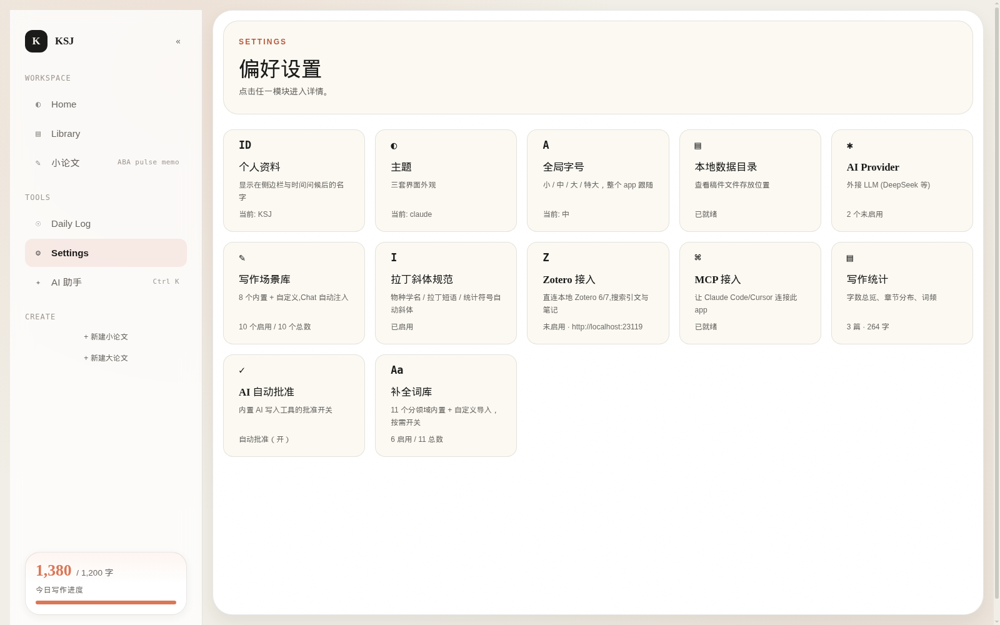
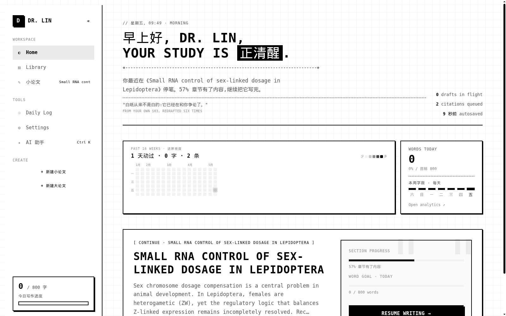
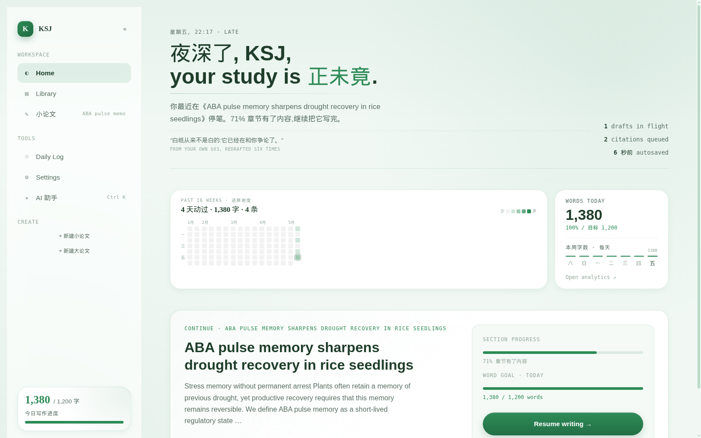

# SciPaper Todo

SciPaper Todo 是一个本地优先的科研论文写作工作台。它不是普通 todo，也不是单纯的 Markdown 编辑器，而是把一篇论文从立题、写作、审稿、修回、导出到学位论文整理都当成一个长期项目来管理。

数据默认保存在你自己的电脑里，应用不依赖云端账号。AI、MCP、Zotero、导入导出都是围绕同一个本地项目库工作。

[下载最新版](https://github.com/1690834643/scipaper-todo-app/releases/latest) · Windows / macOS · Electron + React + local JSON storage

## 截图

| Home | Library |
|---|---|
|  |  |

| 论文工作区 | 沉浸写作 |
|---|---|
|  |  |

| AI 助手 | 设置 |
|---|---|
|  |  |

| Claude | Pixel | Fresh |
|---|---|---|
|  |  |  |

## 适合谁

- 正在写小论文、综述、毕业论文或项目阶段报告的人。
- 需要同时管理正文、审稿意见、回复信、参考文献、附件和每日进展的人。
- 希望 AI 能读写本地论文项目，但又不想把所有数据交给云端工作台的人。
- 使用 Claude Code、Cursor、Cline、Roo Code、Continue、Windsurf 等 MCP 客户端的人。

## 核心工作流

### 小论文写作

每篇小论文按 IMRaD 结构组织：

- Title
- Abstract
- Introduction
- Materials and Methods
- Results
- Discussion
- References

每个章节可以包含多个文本块、图片、PDF 或文件附件。预览页负责读、查和管理，Focus mode 负责真正写作。

### 沉浸写作

Focus mode 内置：

- TipTap / ProseMirror 编辑器
- 标题、粗体、斜体、高亮、引用等格式工具
- 图片/附件插入
- 批注和修订记录
- 章节大纲
- 科研词汇 autocomplete
- AI 抽屉
- 字数统计、每日目标和番茄钟

### 导入

正文和审稿意见共用一个导入助手，但入口和预览会明确区分写入类型。

支持：

- 直接粘贴文本
- 单个或多个 `.txt`
- 单个或多个 `.md`
- `.docx`
- 文本型 `.pdf`

正文导入支持三种拆分：

- 每章一块：按 IMRaD 标题写入对应章节。
- 小标题分块：按 Markdown 小标题拆成多个文本块。
- 整篇一块：写入当前目标章节。

审稿导入会按 reviewer 和 comment 分组，写入已有审稿轮次或新建一轮。

### 导出

文章支持：

- 分享 Markdown：适合发给别人阅读。
- 回导 Markdown：保留章节和文本块标记，适合再导回 SciPaper Todo。
- DOCX：支持模板和拉丁斜体规范。
- LaTeX
- HTML
- JSON
- 分享包
- 完整备份

学位论文支持 Markdown 导出。完整备份仍然是最高保真的恢复格式。

### 审稿和修回

审稿模块支持：

- 多轮审稿
- reviewer 分组
- major / minor comment
- 建议修改章节
- 处理状态
- revision response
- 修改说明
- 人工核验状态

导入审稿信后仍可逐条编辑，避免把 AI 或解析器的判断当成不可改的结果。

### 学位论文

大论文模块支持：

- 学位论文元数据
- 章节正文
- 关联小论文
- 章节文本块增删改
- Markdown 导出

删除学位论文不会删除已关联的小论文。

### Daily Log

Daily Log 用来记录科研日常，不只记录字数：

- 今日计划
- 进展条目
- 阅读 / 实验 / 想法 / 引用 / 分析分类
- 心情
- 番茄钟
- 写作 streak
- 每日字数目标

## AI 和 MCP

SciPaper Todo 支持 OpenAI-compatible 和 Anthropic-compatible provider。AI 助手可以读取当前文章、章节、审稿意见、引用和进度上下文。

写入类 AI 工具默认需要确认。你可以在 Settings 里调整 auto-approve 策略。

内置 MCP 入口：

```text
electron/mcp-cli.cjs
```

示例配置：

```json
{
  "mcpServers": {
    "scipaper-todo": {
      "command": "node",
      "args": ["/path/to/scipaper-todo/electron/mcp-cli.cjs"],
      "env": {
        "HOME": "/mnt/c/Users/<windows-user>"
      }
    }
  }
}
```

如果 MCP 进程和桌面应用不在同一个用户环境里，`HOME` 要指向包含 `Documents/SciPaperTodo` 的用户目录。

## 本地数据

默认数据目录：

```text
Documents/SciPaperTodo/
├── database.json
├── database.json.bak
├── Articles/
│   └── {ArticleId}/
│       ├── Attachments/
│       └── Exports/
└── Theses/
    └── {ThesisId}/
        ├── Attachments/
        └── Exports/
```

数据库是本地 JSON 文件。写入使用临时文件加 rename、`database.json.lock` 文件锁和 `.bak` 备份。Settings 里提供完整备份和恢复。

## 安装

从 Release 页面下载：

https://github.com/1690834643/scipaper-todo-app/releases/latest

Windows：

- `SciPaper-Todo-Setup-x.y.z.exe`：标准安装包。
- `SciPaper-Todo-Portable-x.y.z.exe`：便携版。

macOS：

- `SciPaper-Todo-x.y.z-arm64.dmg` 或 `.zip`：Apple Silicon。
- `SciPaper-Todo-x.y.z-x64.dmg` 或 `.zip`：Intel Mac。

macOS 包目前未签名。首次打开时可右键选择 Open；如果仍被拦截，可运行：

```bash
xattr -dr com.apple.quarantine /Applications/SciPaper\ Todo.app
```

## 开发

```bash
npm ci
npm run dev
```

常用命令：

```bash
npm test
npm run lint
npm run build:renderer
npm run dist:win
npm run dist:mac
```

`npm run dev` 会启动 Vite 和 Electron。Renderer 地址是 `http://127.0.0.1:5173/`。

## 测试

当前仓库包含：

- 存储层测试
- 导入解析测试
- DOCX / PDF 文本提取测试
- LLM 工具审批测试
- MCP / tool router smoke test
- 全局设计契约测试
- Focus mode 设计契约测试
- `tests/tool_sweep.cjs`，覆盖 AI/MCP 工具面

发布前建议运行：

```bash
npm test
npm run lint
npm run build:renderer
HOME=/tmp/scipaper-tool-sweep USERPROFILE=/tmp/scipaper-tool-sweep SCRATCH_HOME_SET=1 node tests/tool_sweep.cjs
```

手动回归清单见：

```text
docs/manual-regression-checklist.md
```

## 发布

GitHub Actions 支持打包发布：

- 推送 `v*` 标签会运行测试、lint、Windows 打包、macOS 打包，并发布 GitHub Release。
- 也可以在 Actions -> Build & Release 里手动运行 workflow。

本地 WSL 交叉构建 Windows 安装包可能受 Wine/rcedit 环境影响。正式发行建议使用 GitHub Actions 的 `windows-latest` 和 `macos-latest`。

## 技术栈

- Electron 37
- React 19
- TypeScript 6
- Vite 8
- TipTap / ProseMirror
- Vitest
- electron-builder
- `@modelcontextprotocol/sdk`

## English Summary

SciPaper Todo is a local-first desktop workspace for scientific manuscript writing. It manages manuscripts, IMRaD sections, reviewer comments, revision responses, thesis sections, progress logs, attachments, exports, and AI/MCP operations in one local project store.

It supports paste and multi-file import for TXT, Markdown, DOCX, and text-based PDF files; exports readable Markdown, re-importable Markdown, DOCX, LaTeX, HTML, JSON, share packages, and full backups; and exposes an MCP server for AI clients with explicit read/write tool boundaries.

All project data is stored under `Documents/SciPaperTodo` by default.
